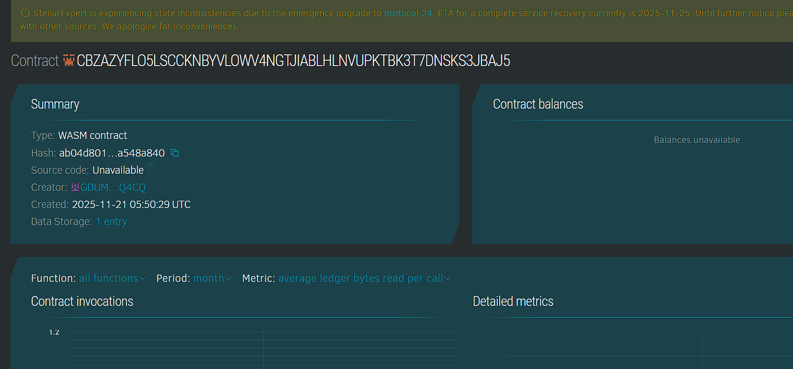

## Project Title
WebPulse Monitor

## Project Description
WebPulse Monitor records uptime checks for registered endpoints by accepting verified check submissions from offchain oracles. Each endpoint is registered with a small hash of the URL and oracles submit boolean up or down checks along with the ledger timestamp. The chain stores those checks as an immutable log.

## Project Vision
The vision is to provide an auditable onchain log of availability events. Oracles perform the active monitoring offchain and commit signed results onchain so consumers can verify historical uptime and oracle provenance.

## Key Features
Register endpoints with a hashed identifier. Oracles submit check results and the contract stores checks with timestamps and oracle addresses. Retrieve the latest check to quickly see current status or examine the log for historical analysis.

## Future Scope
Add oracle staking and reputation to improve data quality. Aggregate checks to compute SLA metrics and emit alerts on threshold breaches. Connect to onchain payout logic to reward reliable oracles or penalize bad reporters.

## Contract Details
Contract ID: CBZAZYFLO5LSCCKNBYVLOWV4NGTJIABLHLNVUPKTBK3T7DNSKS3JBAJ5
